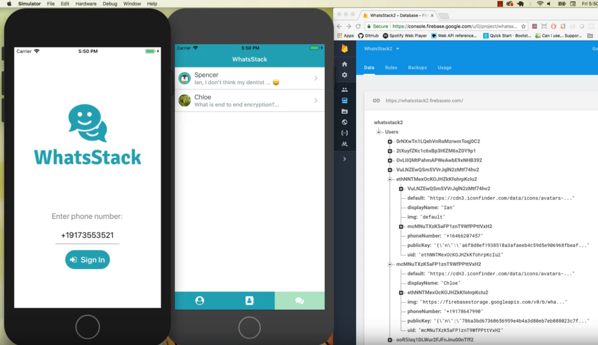

# WhatsStack (An end to end encrypted ios messaging app)

## Team Members

Chloe Chong
Ian Knepper 
Phanousit Syhakhom
Spencer Whitehead

## The App

WhatsStack is an end to end encrypted messaging app for IOS. End to end encryption means that the messages are encrypted before they are sent in such a way that only the sender and receiver can decrypt them. Even someone with total access to the database and source code cannot decrypt a user's messages without the user's private key, which makes E2EE exceptionally secure. This app is both a completely functional messaging app, and a faithful implementation of the core concepts of E2EE.

It cross references the user's contacts with our database and automatically connects you to all your contacts who also have an account with us and allows you to quickly and easily send them secure messages through the app.

## Tech stack

React Native for front end &
React-Native-Firebase for authentication and its database.

### More on end to end encryption

A pretty good explanation of E2EE and why it's so useful/secure can be found here: https://www.lifewire.com/what-is-end-to-end-encryption-4028873

Actually implementing on an IOS app turned out to be simpler than you might expect, and while it requires a good understanding of how E2EE works conceptually, it requires absolutely no understanding of the math that actually makes it work. We used an NPM module with a simple API that does public-private key pair generation and encryption/decryption, and stored each user's public key in our database, where it is accessible to other users. Their private key is stored in their phone's physical memory, and never put online. Users use the recipient's public key to encrypt the message before they send it, and the recipient uses their private key to decrypt it. The version stored in our database and transmitted from user to user is encrypted, and making it useless to intercept messages or get them from our database. (In practice, of course, even this system is vulnerable to many different types of attack, and our hastily implemented system is likely more porous than most, but it's still a lot better than just sending and storing plaintext).

### Unique challenges of messaging apps that use end to end encryption

One difficulty of using E2EE in a messagaing app is that every message has to be stored twice. If you only stored the message encrypted with the receipient's public key, the sender would not be able to read it! Therefore, each message has to be encrypted twice, one with the sender's public key (allowing him to read it with his private key) and once with the receipient's public key, and both versions have to be stored. This adds a huge layer of complexity to group conversations. The group cannot share a single key pair because each member would need the private key, and there's no way to transmit the key without exposing it to interception. Therefore, each group message has to be encrypted with each group member's key and stored in each member's database entry. Then the individual messages have to be reconstructed back into a group conversation.

### Motivations for the project

After 13 weeks at Fullstack Academy, we were about done making CRUD apps and everyone wanted to try something more ambitious and out of the box. We also wanted to do a project tht would force us to use new technologies. There was a **lengthy** period of discussion, but we eventually decided an E2EE messaging app for mobile that used a NOSQL database would be a good mix of doable and challenging. We all had experience with SQL and general web development and had made a simple Slack clone earlier in the course, but none of us had done mobile development, NOSQL, or anything more security intensive than salting and hashing passwords. This project has definitely pushed all of us out of our comfort zones, both in terms of dev environment and tools, and in terms of learning concepts like non-relational databases and E2EE. There are a couple disadvantages to making an iPhone app (non-iPhone users can't use it, it will be very difficult to put on the iPhone app store and therefore difficult to show people), but I think all of us have enjoyed the project a lot and learned a ton.
